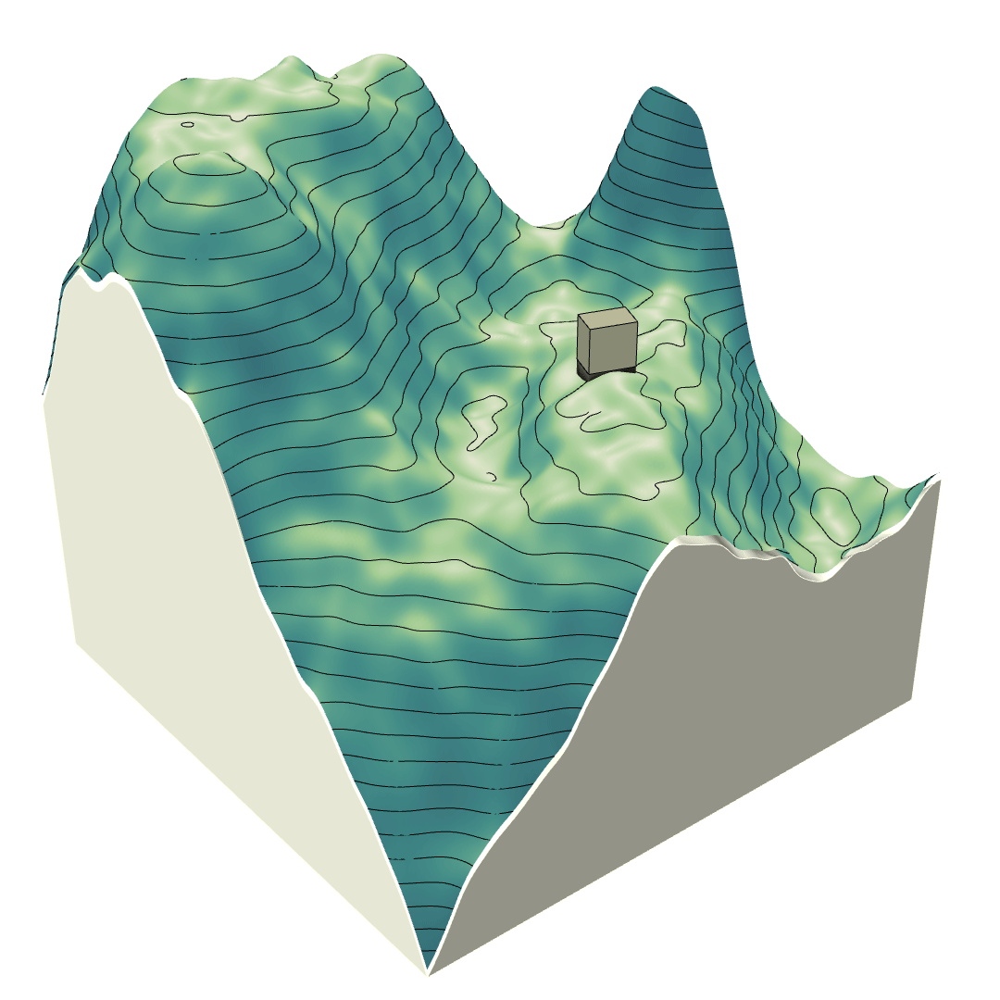

# CutnFill_DeepRL
Positioning a building mass on topography while minimizing the necessary cut and fill excavation volume using actor critic methods.

## Single Building Case
<p align="center">
  
</p>

## Multiple Building Case (10 building sequence)


## Action space
The agent controls the building location through x, y coordinates, anf the angle of rotation theta. This is done through a 3 dimensional discrete action space.
The action space is transformed to a single dimensional large discrete action space as well. Training was performed on both representations of the action space. 

```python
import numpy as np
import torch

# 3-dim action space
param1_space = np.linspace(start=0.1, stop=0.9, num=17)
param2_space = np.linspace(start=0.1, stop=0.9, num=17)
param3_space = np.linspace(start=0, stop=160, num=17)

# 1-dim action space
action_space = np.array(np.meshgrid(param1_space, param2_space, param3_space)).T.reshape(-1,3)
action_space = torch.from_numpy(action_space)

print(f'action space size: {action_space.size()}')
print(action_space)
```

## Reward function
The agent receives a penalty value equivalent to the cut and fill volume necessary to place the building at each step, plus a -5 penalty if the building mass intersects with any previously positioned buildings within the episode (not applicable to the single building case ofc).
The reward signal is computed at each step in the Grasshopper environment according to the following code:

```python
try:
    from ladybug_rhino.grasshopper import all_required_inputs
except ImportError as e:
    raise ImportError('\nFailed to import ladybug_rhino:\n\t{}'.format(e))

if all_required_inputs(ghenv.Component):
    reward = 0
    reward -= Soil_volume / 1000
    done = False

    bInter_relationList = [list(i) for i in bInter_relation.Branches]

    if len(bInter_relationList[0]) > 1:
        for i in bInter_relationList[0]:
            # building mass is inside some previously placed one
            if i == 0:
                reward -= 5
            # building mass intersects with some previously placed one
            elif i == 1:
                reward -= 5
        # compensate for self-intersection
        reward += 5
```
### Terminal state condition
The terminal state is reached after 10 buildings are placed. 

## Acknowledgements
- Our A2C and PPO code is adapted from the excellent implementation provided by [higgsfield/RL-Adventure-2](https://github.com/higgsfield/RL-Adventure-2). 

## References
- [Asynchronous Methods for Deep Reinforcement Learning - Mnih et al. (2016)](https://arxiv.org/abs/1602.01783).
- [Proximal Policy Optimization Algorithms - Schulman et al. (2017)](https://arxiv.org/abs/1707.06347).
- [Efficient Entropy for Policy Gradient with Multidimensional Action Space - Zhang et al. (2018)](https://arxiv.org/abs/1806.00589).
